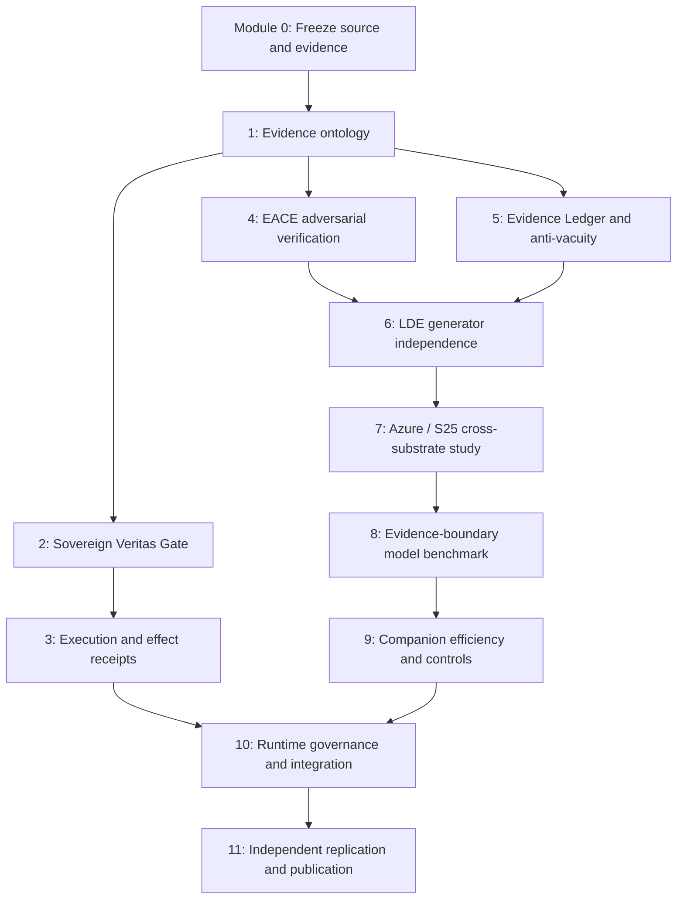

# Evidence-Bounded AI Research: Advanced Open Curriculum

**Edition:** 2026-10-08 | **Author's research:** holland202 | **Status:** Educational synthesis, NOT an independent validation.

## Scope and source status
This curriculum is grounded in GitHub README inspections of `sovereign-veritas`, `sovereign-evolution`, `veritas-companion`, `eace`, `evidence-ledger`, `eunoia`, and `sentinel-batadal-validation`; Hugging Face metadata for `lde-cross-substrate-research` and `sovereign-evidence-bench`; and user-provided HF file listings and Azure terminal output. **Codeberg source was not directly accessible**, so Codeberg exercises require students to inspect the checked-out source and pin its commit before making claims. READMEs are claims by project authors, not independently replicated measurements. No experiment was run to produce this document.

## Audience, prerequisites and safety
Advanced learners who can use Git, Python 3.10+, JSON/JSONL, SHA-256, hypothesis testing, and shell scripts. Android/Termux is optional; Azure is optional. Never run unknown code with credentials; use a disposable environment, pin revisions, and preserve original logs. Never upload SSH keys, tokens, or private machine configuration. Do not interpret simulations as proof of physical-world safety.

## Research contract
For every lab submit: (1) falsifiable claim, (2) precise revision and environment, (3) preregistered expected outcomes and stop conditions, (4) executable commands, (5) raw stdout/stderr and exit codes, (6) SHA-256 manifest, (7) positive and negative controls, (8) mutation/sabotage control, (9) effect sizes and uncertainty where appropriate, (10) conclusion tagged OBSERVED / INFERRED / HYPOTHESIS / NOT VALIDATED. Never silently overwrite failed results. A successful exit code is not a scientific success verdict. A digest match is not source authenticity. A signature is not freshness. Internal consistency is not world truth.

## Course map

### Module 0 — Freeze a three-platform research snapshot (2–3 hours)
**Question:** Can another researcher locate the same exact inputs? **Task:** enumerate GitHub commits, Hugging Face revisions, and Codeberg commits separately; produce `SOURCE_MANIFEST.tsv` with platform, repo, commit SHA, URL, local path, retrieval time, and access status. Never assume mirrors have identical contents. Run `git rev-parse HEAD`, `git status --porcelain`, `git remote -v`, `find . -type f -not -path './.git/*' -print0 | sort -z | xargs -0 sha256sum` on a local checkout. **Controls:** intentionally change one byte and confirm hash mismatch; preserve unchanged control. **Pass:** independent checker reconstructs at least one manifest; unresolved repos marked ACCESS_UNVERIFIED. **Failure:** unpinned `main`, unverified Codeberg mirror, hidden secrets.

### Module 1 — Evidence states and authority (3 hours)
**Sources:** Sovereign Evolution README; Evidence Ledger README. **Question:** Can a system avoid promoting DEFAULTED, ABSENT, OPERATOR, or INFERRED values to MEASURED? Build a state-transition table and test legal/illegal transitions. Include missing thermal data, unreachable model, operator-supplied value, stale reading, and never-wired rule. **Positive control:** valid measured sensor reading with source/time. **Negative control:** invented fallback presented as measurement. **Mutation:** remove evidence-type guard; test must fail. **Pass:** provenance and authority remain separate; all missingness is explicit. **Limit:** provenance metadata alone cannot prove a sensor told the truth.

### Module 2 — Sovereign Veritas: recompute, don't trust labels (4 hours)
**Source:** `https://github.com/holland202/sovereign-veritas` README and CONTRACT.md. **Question:** What exactly does `CONSISTENT` certify? Run repository's documented demo and tests at pinned revision, then generate and verify a package. Compare: genuine; altered digest; revoked authorization with resealed digest; fully consistent rewrite; old but signed package; unavailable runtime state. **Pass:** student explains gate replay versus digest, signature, freshness, and reality; records all verdicts and differences from documentation. **Adversarial challenge:** examine action-to-capability binding including missing/empty action capability; classify as hypothesis until runnable test verifies. **Limit:** code paths and contracts must be inspected before proposing a universal fix.

### Module 3 — Execution-boundary failure modes (4 hours)
**Sources:** SV README execution-boundary and EO-1 findings. **Question:** Can an external effect occur twice, or without a durable record, despite valid gate logic? Design controlled fake executor and ledger. Cases: duplicate sequential ID, concurrent same ID, executor success then ledger failure, no-op executor, wrong action executor, executor running after REFUSE. Record exactly-once versus at-most-once guarantees separately. **Positive:** one authorized action and verifiable effect receipt. **Negative:** executor returns success but no effect. **Mutation:** move reservation after execute and demand suite failure. **Pass:** distinguishes execution intent, call, receipt, effect, and attestation. **Do not:** operate real actuators or payment systems.

### Module 4 — EACE: make the verifier lie (3 hours)
**Source:** `https://github.com/holland202/eace`. **Question:** Does an evidence verifier accept fabricated but well-hashed output? Reproduce documented `test_verifier_robustness_v2.py` and `mutation_check.py` on a pinned revision. Compare both unreconciled v0.2 verifier implementations. **Controls:** true positive, true negative, malicious byte-count match, disabled guard. **Pass:** no false positive in chosen suite and each mutation causes detectable failure; never extrapolate to universal robustness. **Deliverable:** verifier disagreement ledger.

### Module 5 — Evidence Ledger: anti-vacuity and incomplete evidence (3 hours)
**Source:** `https://github.com/holland202/evidence-ledger`. **Question:** Can a system be perfectly internally consistent yet omit decisive evidence? Reproduce EL-007 if available; test `NOT_SUPPORTED` versus `REFUTED`, monotonicity under admissible evidence addition, and an all-rejecting verifier. **Controls:** reachable accepting case, reachable rejection case, sabotaged verifier. **Pass:** failures retained and explicitly tied to contract. **Limit:** append-only API is not durable, tamper-proof storage.

### Module 6 — LDE-2G: generator independence (5 hours)
**Source:** `https://huggingface.co/datasets/holland202/lde-cross-substrate-research`, archived `07_azure_archive/2026-10-07/`. **Question:** Does a selection policy discriminate hypotheses, or merely follow hard-coded discrimination scores? Before running, identify where estimates originate, whether the generator sees target answers, and whether RNG streams are independent. Compare original and split-stream 60-seed results; include argmin, first, last, random, and oracle controls, with frozen definitions. **Reported exploratory data:** original maximal 49/60; split 46/60. Original nonmaximal seeds `[7,8,9,17,20,28,30,34,44,54,59]`; split nonmaximal `[1,11,14,15,19,21,22,28,32,38,49,53,55,59]`. **Paired transition accounting:** 2 seeds fail in both; 9 fail original only; 12 fail split only; 37 succeed in both. Thus 21 discordant seeds, a net 3-case decrease; neither independent samples nor a 5-point aggregate difference alone justifies causality. Confirm counts by program before publishing. **Pass:** show generator code, controls, paired transition table, effect estimate and uncertainty; retain EXPLORATORY_NOT_PREREGISTERED label. **Do not:** retrofit exploratory findings into confirmatory evidence.

### Module 7 — Azure / S25 cross-substrate replication (5 hours)
**Question:** Do differences reflect algorithm, Python version, environment, generator, dependency, or data? Freeze same commit and input bytes on both systems; capture `uname -a`, `python --version`, architecture, dependency lock, CPU/thermal status when available, commands, stdout/stderr, exit codes, and hashes. Separate deterministic-output equality from runtime performance. Include exact seeded replay and multiple-seed sensitivity. **User-supplied artifact:** `07_azure_archive/2026-10-07/evidence/05_exploratory/generator_independence/azure/summary.json` locally hashed to `4a8ba5ad855c89dcd2746eb2e4e4cd2ce243fb2e88fcc85dedb4cec2dd4bb33f`, matching a line in `artifact_hashes.txt`. This proves local byte identity relative to that entry, not original Azure origin. The shown `confirmatory_exit_code.txt` contains `0`; inspect stdout/stderr and result contract before assigning a scientific outcome. **Pass:** independent replication only if full inputs and outputs are available and controls agree; otherwise mark PARTIAL or NOT VALIDATED.

### Module 8 — Sovereign Evidence Bench (4 hours)
**Source:** `https://huggingface.co/datasets/holland202/sovereign-evidence-bench`. **Question:** Can a small model distinguish SUPPORTED, REFUTED and NOT_SUPPORTED under provenance, freshness and injection pressure? Audit 39 hand-built cases and 11 categories reported in dataset description; inspect `oracle.py`, `PREREG.md`, `PREREG_A1.md`, `PREREG_A2.md`, `RESULTS_A1_A2.md`, scoring scripts, per-model JSONL and manifests. **Controls:** lexical-overlap shortcut, class-frequency baseline, random label, oracle leakage audit. **Metrics:** per-class confusion matrix, abstention, injection compliance, macro F1, and paired case outcomes. **Pass:** report per-model differences without assuming 39 cases support broad generalization.

### Module 9 — Veritas Companion: efficiency without self-deception (4 hours)
**Source:** `https://github.com/holland202/veritas-companion`. **Question:** Does a deterministic tier save tokens per correct task on independent logs? Reproduce C001/C002/C006b/C007 as feasible. Compare model-only, deterministic-only, always-escalate, tiered architecture, and cache-disabled baselines. **Metrics:** correct tasks, model tokens, token cost per correct task, latency, coverage, false accepts. **Adversarial controls:** case-fold collision, conflicting log values, unrelated external logs. **Pass:** document where efficiency gain disappears; don't generalize from synthetic repetition.

### Module 10 — Sovereign Evolution and architecture integration (4 hours)
**Sources:** Sovereign Evolution and Eunoia READMEs. **Question:** Can governance rules be reachable, supplied with evidence, and replayable? Trace a single proposed action through context, evidence states, rule completeness, veto, execution, provenance, and replay. Use unreachable accepting-branch findings as an anti-vacuity test. Treat Eunoia as a specification/proposal except where an implemented helper is directly tested. **Pass:** distinguish implemented runtime, proposed architecture, and independent validation; explicitly record unconnected rules.

### Module 11 — Independent reproduction and publication (6 hours)
**Question:** Can a new contributor challenge one claim without trusting its author? Choose one lab; preregister a falsifier; reconstruct environment; run at least one positive, negative and sabotage control; publish raw evidence and hash manifest. Include `README.md`, `CLAIMS.csv`, `REPRODUCE.sh`, `ENVIRONMENT.txt`, `SHA256SUMS`, `raw/`, `analysis/`, `LIMITATIONS.md`, `AMENDMENTS.md`. Use no secrets. **Pass:** independent reviewer can run from clean checkout, reproduce one narrow claim, and identify an explicit falsification condition. **Fail:** polished summary without underlying observations.

## Assessment rubric (100 points)
- Exact revisions, provenance and raw evidence: 20
- Falsifiable preregistration and controls: 20
- Anti-vacuity, mutation and adversarial tests: 20
- Sound statistics and paired-design analysis: 15
- Clear distinction between consistency, authenticity, freshness and truth: 15
- Negative-result preservation and reproducible publication: 10

A lab is **NOT VALIDATED** if source, command, environment, or raw outputs cannot be inspected, regardless of total points. A lab can be pedagogically complete while its hypothesis is refuted.

## Suggested public release structure
`education/00_START_HERE.md`, `education/COURSE.md`, `education/labs/01_EVIDENCE.md` ... `11_REPLICATION.md`, `education/templates/CLAIM_CARD.md`, `education/templates/EXPERIMENT_MANIFEST.json`, `education/INSTRUCTOR_GUIDE.md`. This document is the master course; split only after peer review. Do not overwrite existing HF files. Prefer a new branch or new path and a commit pin.

## Source links
- https://github.com/holland202/sovereign-veritas
- https://github.com/holland202/sovereign-evolution
- https://github.com/holland202/veritas-companion
- https://github.com/holland202/eace
- https://github.com/holland202/evidence-ledger
- https://github.com/holland202/eunoia
- https://github.com/holland202/sentinel-batadal-validation
- https://huggingface.co/datasets/holland202/lde-cross-substrate-research
- https://huggingface.co/datasets/holland202/sovereign-evidence-bench

## Final disclosure
This course synthesizes research authored with AI assistance. It is not a credential, endorsement, independent verification, security certification, or production readiness claim. The most valuable outcome is a reproducible counterexample.